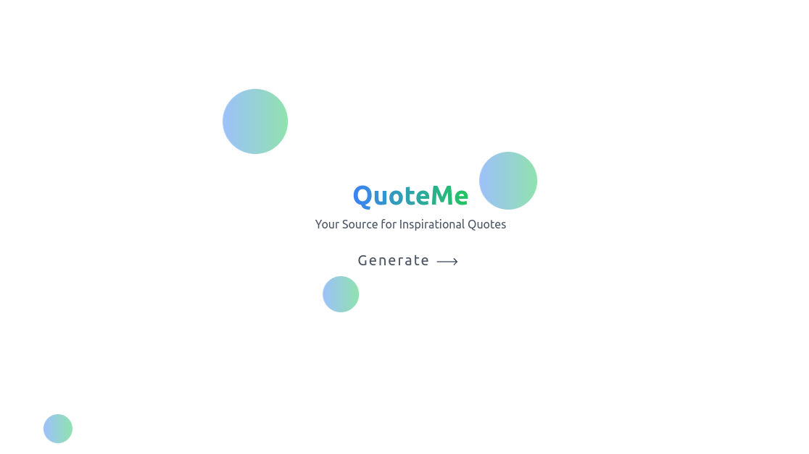
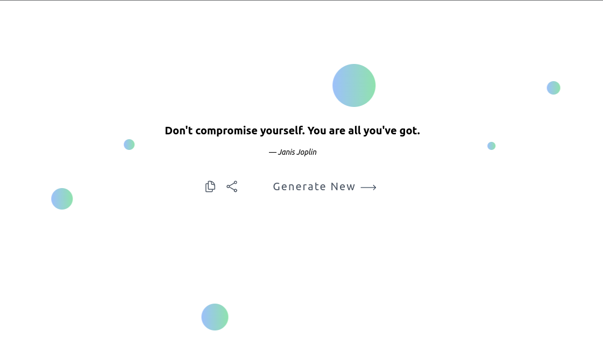

# QuoteMe

Welcome to the QuoteMe - Your source for inspirational Quotes! This project is a simple web application that generates random quotes and allows users to share them on Twitter or copy them to the clipboard. The project is built using React and Tailwind CSS.




## Features

- Generate random quotes
- Share quotes on Twitter
- Copy quotes to the clipboard
- Dynamic animated background

## Quotable API

This project uses the Quotable API to fetch a diverse collection of quotes. The API provides a simple and easy-to-use endpoint for accessing a wide range of quotes from various authors. For more information about the Quotable API and its usage, check out the [Quotable GitHub repository](https://github.com/lukePeavey/quotable).

## Installation

1. Clone the repository:

```bash
git clone https://github.com/your-username/awesome-quote-generator.git
```

2. Navigate to the project directory:
```bash
cd awesome-quote-generator
```

3. Install dependencies
```bash
npm install
```

4. Start the development server
```bash
npm start
```

The application will be available at http://localhost:3000.

## Usage
1. Open the application in your web browser.
2. Click the "Generate" button to get a new random quote.
3. Share the quote on Twitter or copy it to the clipboard using the provided buttons.
4. Explore and enjoy the world of inspirational quotes!


Certainly! Below is a simple README template in Markdown for your project. Feel free to customize it further based on your project's specific details and structure.

markdown
Copy code
# Awesome Quote Generator

Welcome to the Awesome Quote Generator project! This project is a simple web application that generates random quotes and allows users to share them on Twitter or copy them to the clipboard. The project is built using React and Tailwind CSS.

## Features

- Generate random quotes
- Share quotes on Twitter
- Copy quotes to the clipboard

## Installation

1. Clone the repository:

   ```bash
   git clone https://github.com/your-username/awesome-quote-generator.git
Navigate to the project directory:

bash
Copy code
cd awesome-quote-generator
Install dependencies:

bash
Copy code
npm install
Start the development server:

bash
Copy code
npm start
The application will be available at http://localhost:3000.

Usage
Open the application in your web browser.

Click the "Generate" button to get a new random quote.

Share the quote on Twitter or copy it to the clipboard using the provided buttons.

Explore and enjoy the world of inspirational quotes!

Contributing
Contributions are welcome! If you have any ideas for improvements, bug fixes, or new features, please open an issue or submit a pull request.

## License

This project is licensed under the [MIT License](LICENSE). You can find more details in the [LICENSE](LICENSE) file.

Feel free to customize this project according to your needs, and happy coding!

---